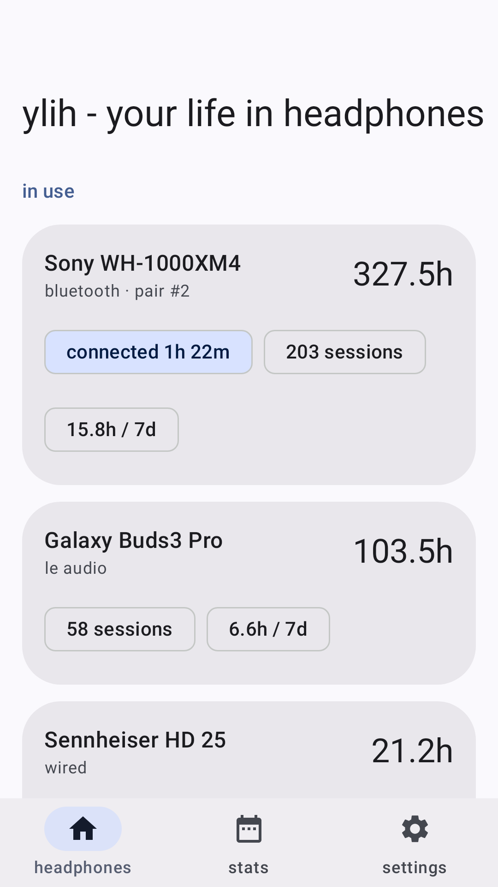
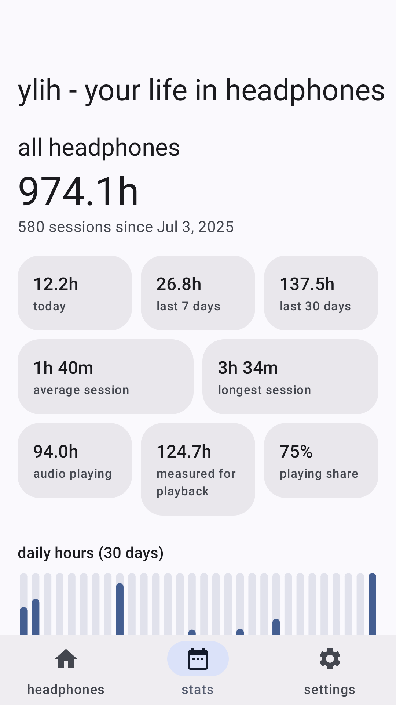
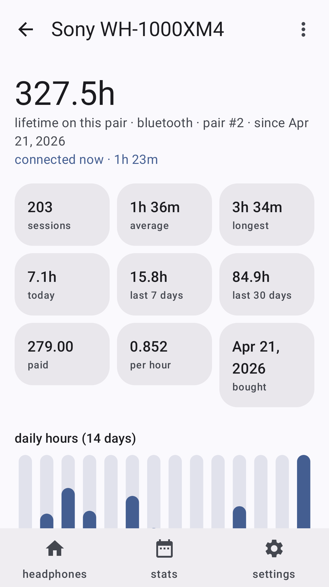
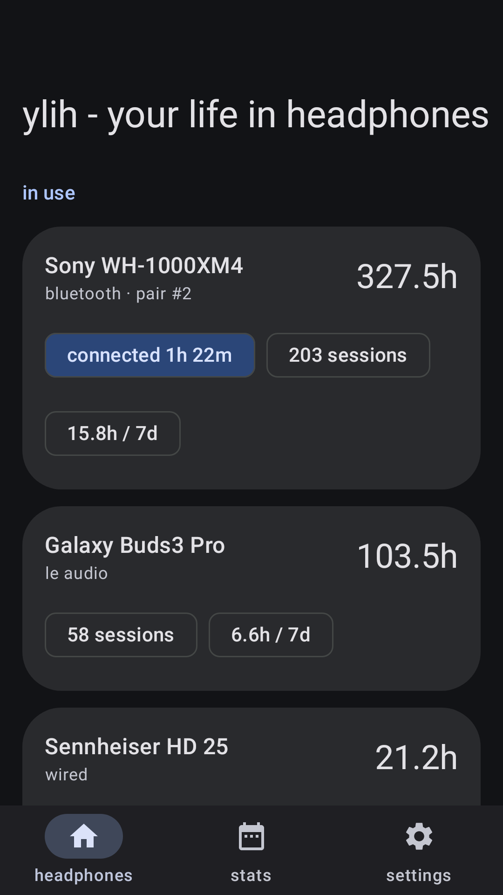

# ylih — your life in headphones

[](https://f-droid.org/packages/it.eldavo.ylih/)
[](https://apps.obtainium.imranr.dev/redirect?r=obtainium://add/https://github.com/ElDavoo/ylih)

<p>
  
  
  
  
</p>

Headphones die. Before they do, ylih answers the only question that really matters about a pair:
**how many hours did you get out of them?**

Every time your headphones connect, ylih writes down when. Every time they disconnect, it writes
down when. That is the whole idea — and it happens by itself, forever, on your phone only.

## What you get

- **Lifetime hours for each pair.** When a pair finally dies, retire it: its total freezes, and
  the next pair of the same model starts again from zero. Your old numbers are never overwritten.
- **Every session, kept for good** — when it started, when it ended, how long it lasted.
- **Listening time, not just connected time** (optional), so headphones worn around your neck
  don't count as listening.
- **Cost per hour**, if you tell it what you paid. It goes down every time you wear them.
- **Hours per charge**, if your headphones report their battery — and how that figure has changed
  since they were new, which is the closest thing there is to watching a battery wear out. A charge
  cycle here is 100% of battery used, however many part-charges that took. Not every pair reports
  its battery to Android; the ones that don't simply have no such section.
- **The last thirty days** as a chart, with every day listed underneath.
- **Home-screen widgets** — lifetime hours, today's total, or the thirty-day chart.

## Two ways to track

Most people never need to change this.

|  | Bluetooth only (default) | Detailed tracking |
|---|---|---|
| Bluetooth headphones | tracked | tracked |
| Wired / USB headphones | not tracked | tracked |
| Listening vs connected time | not measured | measured |
| Notification | **none** | one, silent and hidden away |
| Battery cost | none — nothing runs | small, but not nothing |

By default nothing of the app is running: a connection is just two timestamps, and Android tells
it when they happen. Wired headphones are the exception — Android only reports those to an app
that is already awake, which is why detailed tracking has to keep something running, and why it
is off unless you ask for it. You can turn it on in Settings at any time.

## Your data stays yours

The app has **no internet permission**. Nothing is uploaded, there are no accounts, no analytics
and no ads.

Your history is stored in a database on the phone. Settings → Export writes it out as a readable
file you can keep; Import puts it back. Android's own backup is switched on, so years of history
survive a new phone — that is the system copying the file, not the app sending it anywhere. And
uninstalling offers to keep the data, in case you change your mind.

The full policy is in [PRIVACY.md](PRIVACY.md).

## Which download?

Both are the same app, built from this repository.

- **[F-Droid](https://f-droid.org/packages/it.eldavo.ylih/)** — built and verified by F-Droid.
- **[Obtainium](https://apps.obtainium.imranr.dev/redirect?r=obtainium://add/https://github.com/ElDavoo/ylih)** or the
  [Releases page](https://github.com/ElDavoo/ylih/releases) — updates straight from here.
- **Google Play** — one small difference: to track *wired* headphones there, you also have to
  allow Bluetooth access, which Play's rules make unavoidable. Everything else is identical.

The app speaks **77 languages** and follows your system language.

## Why you can trust the numbers

Long-term totals are worthless if a crash or a reboot quietly adds twelve hours to them. So:

- Time your phone spent switched off is never counted.
- A session interrupted by a reboot or a crash is closed at the last moment it was known to be
  connected — never guessed forwards.
- The same connection can never be counted twice.

These rules are the app's whole reason to exist, and they are pinned by tests that fail the build
if they ever stop holding.

## For developers

It's Kotlin, Jetpack Compose, Room and Glance widgets, built with Gradle. A nix dev shell pins the
exact JDK, Gradle and Android SDK:

```sh
nix develop                        # or: direnv allow
./gradlew assembleClassicDebug     # sideload build
./gradlew installClassicDebug
```

Without nix: JDK 21, Android SDK platform `android-37.0` and build-tools `37.0.0`; the Gradle
wrapper does the rest. There are two flavors — `classic` (F-Droid and GitHub) and `play` — so
every task is flavor-qualified, and there is no plain `assembleDebug`.

```sh
# what CI runs, per flavor
./gradlew lintClassicReleaseTest testClassicReleaseTestUnitTest \
          assembleClassicDebug assembleClassicRelease
```

Lint and the Kotlin compiler both run with warnings as errors and no baseline, so a warning fails
the build. The test suite is mostly Robolectric and is gated on coverage in CI.

- [CLAUDE.md](CLAUDE.md) — the architecture in depth: the write funnel and its invariants, device
  identity, the widgets, the build-system constraints and why each one is the way it is.
- [docs/play-store.md](docs/play-store.md) — the Play release runbook.
- [docs/fdroid.md](docs/fdroid.md) — the F-Droid runbook; the build recipe is at
  [metadata/it.eldavo.ylih.yml](metadata/it.eldavo.ylih.yml).

Store screenshots, the icon and the feature graphic are generated rather than drawn — they render
the real UI on the JVM, so they cannot drift away from the shipped app:

```sh
./gradlew recordRoborazziClassicReleaseTest
```

## License

MIT — see [LICENSE](LICENSE).
